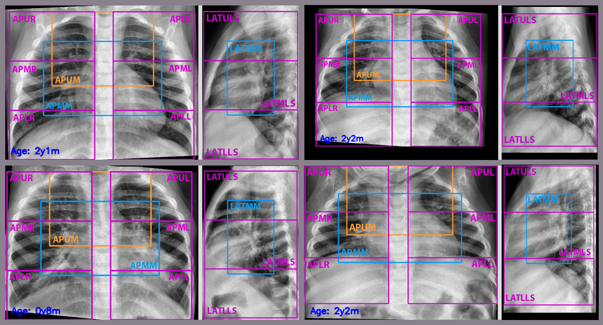

# Lung Region Extractor for Pediatric Chest X-ray Images
Multi-view deep learning-based solution that extracts lung and mediastinal regions of interest from pediatric chest X-ray images where key Tuberculosis findings may be present.
## Introduction
Tuberculosis (TB) is still considered a leading cause of death and a substantial threat to global child health. Both TB infection and disease are curable using antibiotics. However, most children who die of TB are never diagnosed or treated. In clinical practice, experienced physicians assess TB by examining chest X-rays (CXR). Pediatric CXR has specific challenges compared to adult CXR, which makes TB diagnosis in children more difficult. Computer-aided diagnosis systems supported by Artificial Intelligence have shown performance comparable to experienced radiologist TB readings, which could ease mass TB screening and reduce clinical burden. We propose a multi-view deep learning-based solution which, by following a proposed template, aims to automatically regionalize and extract lung and mediastinal regions of interest from pediatric CXR images where key TB findings may be present. Experimental results have shown accurate region extraction, which can be used for further analysis to confirm TB finding presence and severity assessment.

<p align="center">

</p>

<p align="center">

</p>

## Table of Contents

- [Introduction](#introduction)
- [Table of Contents](#table-of-contents)
- [Installation](#installation)
- [Usage](#usage)
    - [Minimal Working Example (MWE)](#minimal-working-example-mwe)
    - [Useful Tips and Considerations](#useful-tips-and-considerations)
- [References](#references)
- [How to cite](#how-to-cite)

## Installation

We highly recommend creating a virtual environment for this task. Please follow the steps:

1. Create a virtual environment using `environment.yml`: conda env create -f environment.yml.
2. Install nnU-Net following the steps detailed in their documentation: https://github.com/MIC-DKFZ/nnUNet.
    - Install it as **integrative framework**.
    - It is important to follow all the steps appropiately. You will need to set a few of environment variables for it to work.
3. Download pre-trained models from [here](docs/models.md). All weights except those of nnU-Net are already downloaded when cloning the repo. Please refer to the previous link to download nnU-Net weights and place them in a folder called nnunet_models in the code directory (./nnunet_models).
4. Install the nnU-Net 2D models (.zip) by entering the following commands:

    ```bash
    nnUNet_install_pretrained_model_from_zip ./nnunet_models/pTB_nnunet_model_AP.zip
    nnUNet_install_pretrained_model_from_zip ./nnunet_models/pTB_nnunet_model_LAT.zip
    ```

5. Clone yolov5 repository. Follow steps in https://github.com/ultralytics/yolov5.

## Usage

Command for running the process:

`python process.py --csv CSV_FILE --seg_model MODEL --output_folder OUT_FOLDER --fformat FILE_FORMAT`

where:
- `CSV_FILE` refers to a CSV file with the data inputted to the system (see example in dataset.csv).
- `MODEL` selects which model is used for the semantic segmentation process. It can be either `nnunet` [1], `medt` or `gatedaxialunet` [2] (see references for further information).
- `OUT_FOLDER` is the folder where the results are saved.
- `FILE_FORMAT` refers to the format of the input images. It can be either `jpg`,`png` or `nifti`.

By default, preprocessing with CLAHE is applied to the input images. If CLAHE is not desired in the preprocessing step, add the flag `--no_clahe` at the end of the previous command.

### Minimal Working Example (MWE)

The following command executes a minimal working example (MWE). Please check that everything works as expected.

    python process.py --csv dataset.csv --seg_model nnunet --output_folder ./RESULTS/mwe --fformat jpg`

### Useful Tips and Considerations

- If using MedT or GatedAxialUNet for the segmentation process, only use one GPU for inference (Multi-GPU for inference is not recommended in these cases and may deliver wrong results). To do so, use `CUDA_VISIBLE_DEVICES=0,1,...` at the beggining of the command. Following the MWE, if we want to use GPU #0:

    ```bash
    CUDA_VISIBLE_DEVICES=0 python process.py --csv dataset.csv --seg_model nnunet --output_folder ./RESULTS/mwe --fformat jpg
    ```

- In the CSV, use the same column names as in the sample. `PatientID` string should be part of AP/LAT image filenames. Example: `ITA2-0326` -> `TB0_ITA2-0326-AP-20130116.jpg`

- DO NOT name the input files with:
    - More than one underscore.
    - Only numbers.
    
    Otherwise, the process may raise a exception. Suggested file naming: <COHORT IDENTIFIER>_<CASE_IDENTIFIER>.<FORMAT>. Example: COH_001.jpg

## References

[1] F. Isensee, P. F. Jaeger, S. A. A. Kohl, J. Petersen, and K. H. Maier-Hein, “nnU-Net: a self-configuring method for deep learning-based biomedical image segmentation,” Nat. Methods 2020 182, vol. 18, no. 2, pp. 203–211, Dec. 2020, doi: 10.1038/s41592-020-01008-z.

[2] J. Maria, J. Valanarasu, P. Oza, I. Hacihaliloglu, and V. M. Patel, “Medical transformer: Gated axial-attention for medical image segmentation,” arxiv.org, Accessed: Dec. 16, 2021. [Online]. Available: https://arxiv.org/abs/2102.10662

## How to cite

Please cite us if you are using this code!

    Capellán-Martín D., Gómez-Valverde Juan J., Sanchez-Jacob R., Bermejo-Peláez D., García-Delgado L., López-Varela E., Ledesma-Carbayo María J. (2022) Deep learning-based lung segmentation and automatic regional template in chest X-ray images for pediatric tuberculosis.

Note: Still in process of submission/acceptance. Please contact us if there is any issue, comment and/or suggestion.